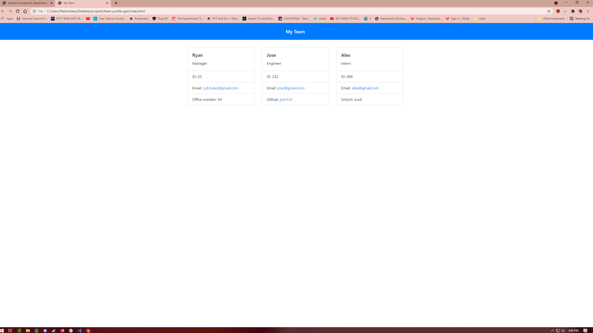

# team-profile-gen
  
  
  ## Description:  
  This project creates a quick Roster of a team including a Manager, Engineer's, and Interns. and outputs information regarding those team members. I unfortunetly did not finish the project so what I have is the code w/out tests ran.

  ## Table of Contents:  
  - [Description](#description)
  - [Table of Contents](#table-of-contents)
  - [Installation](#installation)
  - [Usage](#usage)
  - [License](#license)
  - [Contributing](#contributing)
  - [Tests](#tests)
  - [Questions](#questions)

  ## Installation:  
  1. go to the Github repo. 2. Clone the repo. 3. install the dependencies. 4. Run with: node app.js in the terminal

  ## Usage:  
  Run the program, then answer the provided prompts and the program will generate an html page that can be opened on a browser
  
  ## License:  
  Licensed under [MIT]
  
  
  ## Tests:  
  Creating a roster of a project/team to compile and keep track of name, IDs, emails, roles, and other misc.

  
  
